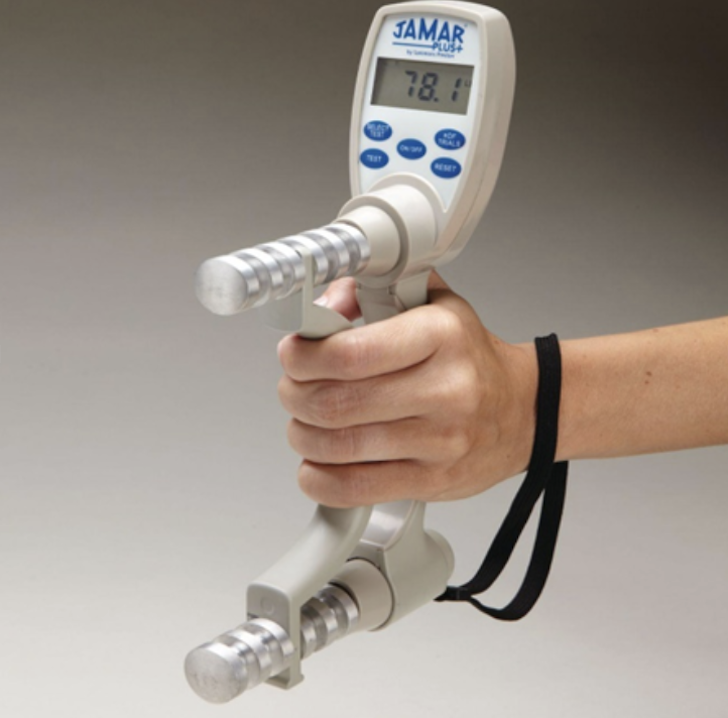

# Hand grip strength dataset  

### Description

Hand grip strength (HGS) is an effective marker of general health in middle age and older adulthood. Grip strength is measured by squeezing a type of muscle strength testing equipment, known as a dynamometer.

### Introduction

HGS is a measure of the maximum force that an individual can exert with their hand. It is a widely used measure of muscular strength. HGS is an easy and quick measure to obtain.

In a clinical setting, HGS is often used as a measure to assess changes in muscle strength over time. For example, in patients with conditions such as osteoarthritis, rheumatoid arthritis, or sarcopenia, Additionally, HGS can be used to assess the effectiveness of rehabilitation programs, such as those used to recover from a stroke or other neurological condition.

HGS is also used in research studies to investigate the relationship between muscle strength and various health outcomes, such as cardiovascular disease (CVD), respiratory function, and mortality. Studies have shown that low HGS is associated with increased risk of these and other health conditions, highlighting the importance of this measure in identifying individuals at risk for these conditions. Low HGS can be a warning sign of frailty, especially in older adults, as well as muscle wasting and weakness. Based on this, HGS can be used as a simple, non-invasive and inexpensive method to predict physical frailty and disability.

### Measurment protocol <!-- long measurment protocol for the data browser -->

HGS is measured using a Jamar Hydraulic Hand Dynamometer (see figure below). The measurement is a measure of the static force (without movement) that the hand can exert when squeezing around the dynamometer. The measurement is recorded in pounds initially, and then converted to kilograms.

The participant is asked to sit upright in a chair with the arm bent to a 90° angle so that their forearm is pointing forward, with their thumb uppermost. The participant is asked to hold the device first in their dominant hand, and adjust the handle of the dynamometer as necessary, ensuring the base rests on the first metacarpal and the handle on the middle of the four fingers. The participant is asked to squeeze the handle of the dynamometer, for at least 3 seconds. The results are manually recorded and then the measurement is repeated for the non-dominant hand.

### Data availability <!-- for the example notebooks -->

The information is stored in 1 parquet file: `hand_grip.parquet`

### Summary of available data <!-- for the data browser -->

1. Raw data: a data frame containing individual level hand grip strength measurements.

### Relevent links

* Pheno Knowledgebase: https://knowledgebase.pheno.ai/datasets/006-hand_grip.html