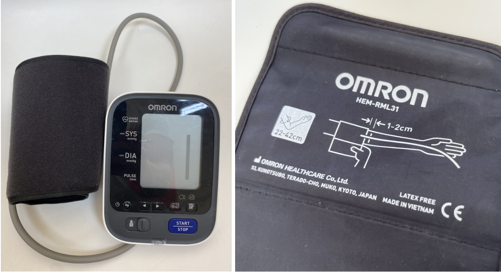

# Blood pressure dataset 

### Description

Blood pressure is the measurement of the force exerted against the walls of the arteries as blood flows through them. Blood pressure is recorded as two values: systolic pressure (the maximum arterial pressure during left ventricular contraction) and diastolic pressure (the minimum arterial pressure during left ventricular relaxation).

### Introduction

Hypertension, or elevated blood pressure, is a significant risk factor for cardiovascular disease and cerebrovascular events, contributing substantially to global mortality and morbidity. Chronic hypertension is characterized by persistently elevated arterial pressure, which increases cardiac workload and can lead to cardiovascular complications. Conversely, hypotension, or abnormally low blood pressure, can be equally detrimental. Severe hypotension may result in inadequate perfusion of vital organs, potentially leading to insufficient oxygen and nutrient delivery, and in extreme cases, progressing to circulatory shock, a life-threatening condition.

Blood pressure measurement can be performed in a variety of settings, including hospitals, clinics, and even at home, using an automated or manual sphygmomanometer. Blood pressure measurement can be used to monitor the effectiveness of treatment interventions, such as lifestyle changes. The goal of treatment is to achieve and maintain target blood pressure levels, which are generally lower for individuals at higher risk for cardiovascular disease. 

### Measurement protocol 
<!-- long measurment protocol for the data browser -->
Blood pressure is measured using an OMRON Blood Pressure Monitor HEM-RML31 device and an appropriately sized cuff. Multiple blood pressure readings are done during the visit. For each blood pressure reading, three measurements are taken: systolic pressure, diastolic pressure, and average heart rate. The participant is asked to avoid caffeine, exercise and smoking at least 30 minutes before the measurement. The measurement is taken on the left arm if possible. The cuff size is based on the arm circumference. 

The participant is seated for 5 minutes, after which the first measurement is taken. Repeat a second measurement after 2 minutes. The participant then lies down for 5 minutes and the lying blood pressure reading is taken. The participant then stands up, slowly. The first standing reading is taken after 1 minute of standing and the next reading after 3 minutes of standing. The participant is asked to report about dizziness on standing up.

### Data availability 
<!-- for the example notebooks -->
The information is stored in 1 parquet file: `blood_pressure.parquet`

### Summary of available data 
<!-- for the data browser -->
1. Raw data: a data frame containing individual level blood pressure measurements.

### Relevant links

* Pheno Knowledgebase: https://knowledgebase.pheno.ai/datasets/007-blood_pressure.html
