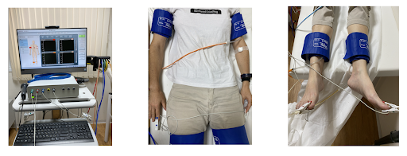

# Peripheral vascular health dataset  

### Description

Ankle-Brachial Index (ABI) and Pulse Wave Velocity (PWV) are measured in the Human Phenotype Project to assess vascular health. ABI is a ratio of the blood pressure in the ankle to the blood pressure in the arm. PWV, is the speed at which the pulse wave of the blood pressure travels along the wall of an artery or a combined length of arteries.

### Introduction

ABI and PWV are measured in the Human Phenotype Project to assess vascular health. ABI is a ratio of the systolic blood pressure in the ankle to the systolic blood pressure in the arm. PWV is the speed at which the pulse wave of the blood pressure travels along the wall of an artery or a combined length of arteries.

#### ABI
Ankle-Brachial Index (ABI) measurements were conducted using the Falcon (Viasonix, Israel) device while subjects were in supine position. During the ABI test, primary systolic pressures are measured in each of the right and left brachial arteries, and right and left ankles. ABI is determined as the ratio between the brachial systolic pressure and the ankle pressure on each side providing ABI values per each side. The systolic pressures were based on a combination of blood pressure cuffs and blood flow reading with photoplethysmograph (PPG) sensors placed on the measured limb fingers.  Under normal circumstances, the blood pressure in the ankle will be very similar or identical to that measured in the arm, so the measured ABI value will be close to 1. In the case of peripheral arterial disease, there will be a discrepancy - the blood pressure at the ankle will be lower than the blood pressure in the arms. This will indicate insufficiency in the arteries that carry blood to the legs. In the general population, PAD affects about 10% of people over the age of 55.

#### PWV
Pulse wave velocity (PWV) is considered a surrogate marker for arterial stiffness/elasticity, which is correlated with vascular disease (REF). Vascular elasticity is important for the normal vascular function for attenuation and smoothing of the pulsation intensity and blood flow. With age, and in combination with atherosclerosis processes, blood vessels may lose their elasticity and become stiff. Increased arterial stiffness can predict future vascular system problems.The contractions of the heart generate arterial blood pressure pulse waves which propagate through the arterial walls. PWV is defined as the velocity at which these arterial blood pressure pulses propagate. PWV is a quantitative parameter reflecting arterial stiffness. Higher PWV values reflect greater than normal arterial stiffness. 
While there is no one set standard of how or where to measure PWV, some of the more common PWV measurements include the baPWV, which reflects the pulse wave propagation between the brachial and ankle, cfPWV reflecting propagation between the carotid and femoral, and faPWV also know as leg PWV reflecting the PWV along the leg between the femoral and ankle.
In the HPP we measure leg PWV (faPWV). PWV is highly dependent on the method of measurement, as well as on the measurement sites. Therefore, typical values for baPWV differ from faPWV and cfPWV.
Based on literature reports, normal PWV values can range between around 6 m/s to 14 m/s, depending on the method of measurement, location and the patient’s age. For example, according to Laurent et al.  the PWV increases from 4–5 m/s in the ascending aorta to 5–6 m/s in the abdominal aorta then 8–9 m/s in the iliac and femoral arteries (Laurent et al. European Heart Journal (2006) 27, 2588–2605)

PWV has been recognized as an indicator of organ damage and a useful additional test in the investigation of high blood pressure, it is also a useful method for prediction of cardiovascular events and mortality. Studies have also shown that ABI is a reliable predictor of cardiovascular disease and mortality in patients with peripheral artery disease.

### Measurement protocol 
<!-- long measurment protocol for the data browser -->
Measuring the systolic blood pressure with the Falcon is based on a combination of both blood pressure cuffs and a Photoplethysmograph (PPG) sensor. A blood pressure cuff is wrapped around the measured site, and a distal PPG waveform is obtained by the PPG sensor. Firstly, the cuff is inflated until the distal signal disappears as a result of the total occlusion (The cuff produces higher pressure than the artery). Secondly, the blood pressure cuff is deflated in a controlled manner, and the cuff pressure at which the distal signal re-appears is determined as the systolic pressure of the artery (will occur after pressure equalization between the cuff and the artery).

The measurement of PWV is based on the definition of velocity, i.e., distance divided by time. The initial systolic upstroke serves as a time marker. When the arterial pulse wave propagates along with the arterial circulation, there is a short time delay between the proximal and the distal measurement sites, i.e the propagation time between them. The distance between the two measurements is measured directly using a measurement tape. The measurement is performed with the aid of blood pressure cuffs. These cuffs are wrapped around the ankle and thigh.

### Data availability 
<!-- for the example notebooks -->
The information is stored in 1 parquet file: `vascular_health.parquet`

### Summary of available data 
<!-- for the data browser -->
1. ABI and PWV measurements: A data frame of computed features provided by the manufacturer based on the above channels

### Relevant links

* Pheno Knowledgebase: https://knowledgebase.pheno.ai/datasets/010-peripheral_vascular_health.html
* Pheno Data Browser: https://pheno-demo-app.vercel.app/folder/10