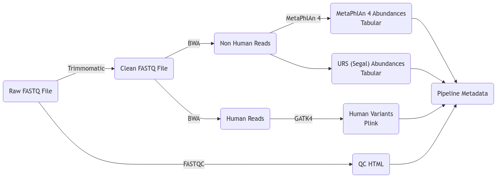

# Gut microbiome dataset  

### Description 
<!-- just for gut microbiome: shortened from the original introduction in the data doc -->
Metagenomics is the study of genetic material from environmental samples, including microbial communities. It involves sequencing the DNA of all microorganisms in the sample, rather than isolating individual organisms. Metagenomics enables the identification and functional analysis of microorganisms in diverse environments, including soil, water, and the human body.

This dataset maps out the human gut microbiota per participant via shotgun metagenomic sequencing given stool samples. It is then compared to known references of gut flora to measure prevalence of specific microbes.

### Introduction 
<!-- just for gut microbiome: shortened from the original introduction in the data doc -->
The human gut, a complex and dynamic ecosystem, harbors a myriad of microorganisms collectively known as the gut microbiome. This community plays a critical role in various physiological processes such as immune modulation, metabolic regulation, and even functions as an endocrine organ. However, the vast complexity and diversity of the gut microbiome have remained largely elusive due to traditional culture methods' limitations. Recent advances in next-generation sequencing technologies, particularly metagenomics, have paved the way for a more comprehensive understanding of the gut microbiome.

Gut metagenomics refers to the study of the collective genetic material of all microorganisms present in the gut, gleaned directly from fecal samples. It provides a powerful tool for the identification and quantification of diverse microbial species and their functional roles, including their influence on metabolic pathways, their virulence factors, antibiotic resistance profiles, and more. Moreover, gut metagenomics can reveal the taxonomic diversity and community structure of the microbiome, offering insights into the intricate relationship between the microbiome and its host.

### Measurement protocol 
<!-- long measurment protocol for the data browser -->
To measure the genetic makeup of the human gut flora given stool samples via metagenomics, the following steps done:

1. Collection of stool sample: For each visit, a stool sample is collected from the individual and stored appropriately to preserve the microbial community.
2. DNA extraction: DNA is extracted from the stool sample using specialized techniques to isolate the microbial DNA from other materials present in the sample.
3. DNA fragmentation and sequencing: The extracted DNA is then fragmented into small pieces and sequenced using high-throughput sequencing technologies.
4. Quality control: The resulting raw sequencing data is then pre-processed, removing low-quality reads and artifacts of the sequencing methodology.
5. Taxonomic classification: The processed sequencing data is then compared to databases of known microbial sequences to identify and classify the microbial species presence and their respective abundances in the sample.

### Data availability 
<!-- for the example notebooks -->
The information is stored in multiple parquet files:
- `gut_microbiome.parquet`: Sequencing and QC statistics.
- `urs`: Segal Lab relative abundance.
- `metaphlan_*`: 8 tables with MetaPhlAn 4 relative abundances, separated by taxonomic levels.

```mermaid
graph LR;
    A(Raw FASTQ File) --> |Trimmomatic| B(Clean FASTQ File)
    A --> |FASTQC| C(QC HTML)
    
    B --> |BWA| D(Non Human Reads)
    B --> |BWA| E(Human Reads)
    
    D --> |MetaPhlAn 4| F(MetaPhlAn 4 Abundances<br>Tabular)
    D --> G("URS (Segal) Abundances<br>Tabular")
    
    E --> |GATK4| H(Human Variants<br>Plink)
    
    F --> I(Pipeline Metadata)
    G --> I
    H --> I
    C --> I
```

### Summary of available data 
<!-- for the data browser -->
1. Sequencing and QC statistics.
2. FASTQ files: Raw sequencing files, trimmed files, and files filtered from human reads.
3. PLINK BED files: Containing human variants.
4. URS relative abundances of 3594 representative gut microbes.
5. MetaPhlAn 4 relative abundances, separated by taxonomic levels.
    - The data browser displays the relative abundances of a subset of 300 bacterial species.

### Relevant links

* Pheno Knowledgebase: https://knowledgebase.pheno.ai/datasets/013-gut_microbiome.html