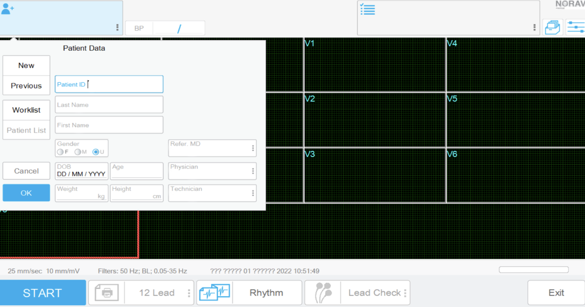

# ECG dataset  

### Description 

An electrocardiogram (ECG) is a simple test that can be used to check your heart's rhythm and electrical activity. Sensors attached to the skin are used to detect the electrical signals produced by the heart each time it beats.

### Introduction

Cardiovascular diseases are one of the leading causes of death worldwide. An ECG is the most representative and important non-invasive tool for diagnosing cardiac abnormalities.At every beat, the heart is depolarized to trigger its contraction. This electrical activity is transmitted throughout the body and can be picked up on the skin. An ECG machine records this activity via electrodes on the skin and displays it graphically.

An ECG is a graph of voltage with respect to time that reflects the electrical activities of cardiac muscle depolarization followed by repolarization during each heartbeat. The ECG graph of a normal beat consists of a sequence of waves, a P-wave representing the atrial depolarization process, a QRS complex denoting the ventricular depolarization process, and a T-wave representing the ventricular repolarization. Other portions of the signal include the PR, ST, and QT intervals. 

Commonly, 10 electrodes attached to the body are used to form 12 ECG leads, with each lead measuring a specific electrical potential difference. Electrodes combinations can measure the electrical potential difference between two corresponding locations of attachment. Such a pair forms a lead. The different leads are regularly divided into limb; augmented limb; and precordial or chest leads. The 12-lead ECG has a total of three limb leads (I, II, II) and three augmented limb leads (aVR, aVL, aVF) corresponding to a coronal plane (vertical), and six precordial leads or chest leads (V1-V6) that lie on the perpendicular transverse plane (horizontal).

A resting 12-lead ECG is recorded at each visit for participants. The record length is 10 seconds and the sample rate is 1000Hz. We collect both the raw waveform ECG signal from all leads and tabular data. The tabular data are features which have been extracted automatically by the machine from the raw data such as the P wave duration.

### Measurement protocol 
<!-- long measurment protocol for the data browser -->
A 10 second resting electrocardiogram (ECG) using a 12 Lead Norav ECG machine is done for each participant. The equipment used includes an electrode belt, limb crocodile clips, a 12 Lead Norav ECG machine, and a device cart and computer. 

The device settings include a sample rate of 1000Hz, a minimum test time of 10 seconds, and various filters such as an AC noise filter, EMG filter, and a baseline filter. The protocol involves turning on the computer and entering the "resting ECG" software, verifying the participant's identity, and attaching the electrode belt and limb crocodile clips to the participant's chest. The figure below shows the software system used to record the ECG.

The participant is instructed to take normal deep breaths and to remain still during the 10 second recording. The ECG is then interpreted and, if necessary, the test can be repeated.

### Data availability 
<!-- for the example notebooks -->
The information is stored in 2 tabular parquet files: `ecg.parquet`, `ecg_qc.parquet`, which contain tabular features and QC checks on the raw ECG waveform data. Mutiple time series parquet files contain the raw and processed ECG waveform data

### Summary of available data 
<!-- for the data browser -->
1. Raw waveform signal: a data frame for each participant containing the raw ECG signal from the 12 different leads.
2. Processed waveform signal: a data frame for each participant containing the processed ECG signal from the 12 different leads using the NeuroKit python package.
3. Tabular features: a data frame containing ECG related features extracted automatically by the machine.

### Relevant links

* Pheno Knowledgebase: https://knowledgebase.pheno.ai/datasets/015-ecg.html
* Pheno Data Browser: https://pheno-demo-app.vercel.app/folder/15