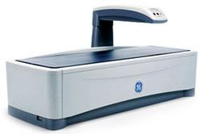

# Bone size, mineral and density (DXA) dataset  

### Description 

Bone density was profiled based on DXA imaging, and includes measurements of mineral content in different parts of a variety of skeletal components.

### Introduction

DXA (dual-energy x-ray absorptiometry) imaging is a method used to measure bone density and mineral content. A DXA scan uses a low dose of ionizing radiation to produce a detailed image of the body, specifically the bones. The scan is then analyzed by a software to determine the bone mineral density (BMD) and bone mineral content (BMC) in different parts of the body. This method is considered to be one of the most accurate methods for measuring bone density, as it is able to provide detailed information about the distribution of bone mineral content in different bony structures of the body skeleton. The spine and hip are most commonly measured because that is where most osteoporotic fractures occur. DXA imaging is commonly used for assessing the risk of osteoporosis, a condition characterized by low bone density and increased risk of fractures, and for monitoring the effects of treatments for the condition.

### Measurement protocol 
<!-- long measurment protocol for the data browser -->
Dual-energy X-ray Absorptiometry (DXA) was performed with the GE Lunar Prodigy Advance device (GE Healthcare, USA) and the GE CoreScan and OneScan software applications. Before the scan, participants were asked to remove all metal items, heavy clothing and shoes. Bone mineral density was measured from the Femur necks, bilaterally and from the spine vertebra L1-L4. The Spine and femur imaging was performed with the OneScan, which performs an anterior posterior (AP) Spine and the dual femur exam without repositioning between scans. Participants were placed on the scanner bed with legs internally rotated and secured using a foot brace. 
The AP Spine measurement and analysis provides an estimate of bone mineral density for the lumbar spine while the Dual Femur measurement measures the density in the proximal femurs (femur neck). These values can then be compared to reference populations providing Z-scores that are matched for age, sex and ethnicity; and T-scores which indicate how many standard deviations a patient's value is from the mean value of a healthy Young Adult reference population (NHANES).  

### Data availability 
<!-- for the example notebooks -->
The information is stored in 1 parquet file: `bone_density.parquet`

### Summary of available data 
<!-- for the data browser -->
1. Measurements of mineral content in different parts of a variety of skeletal components.
2. Age, sex and ethnicity normalized values for the above measurements.
3. DXA image files (e.g., total body composition - BMD).
4. DXA image DICOM files.

### Relevant links

* Pheno Knowledgebase: https://knowledgebase.pheno.ai/datasets/022-bone_density.html
* Pheno Data Browser: https://pheno-demo-app.vercel.app/folder/22
