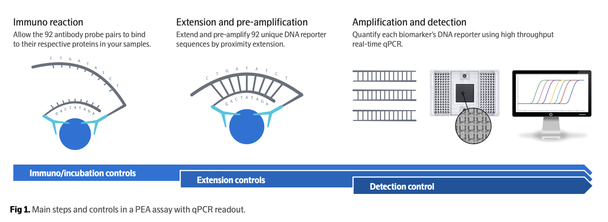
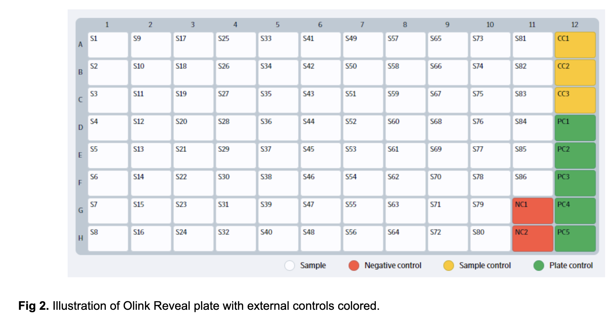

# Olink Proteomics dataset  

### Description

The HPP Olink dataset contains relative protein expression profiles for thousands of proteins measured in plasma from HPP participants, using Olink Reveal, an NGS‑based Proximity Extension Assay (PEA) platform. Each assay uses pairs of antibodies coupled to DNA oligos: when both antibodies bind the same protein, their oligos come into proximity, are extended, PCR‑amplified, and quantified via Illumina sequencing ([Multiplex high-throughput proteomics with exceptional analytical specificity |  illumina in collaboration with Olink](https://www.illumina.com/content/dam/illumina/gcs/assembled-assets/marketing-literature/olink-proteomics-tech-note-m-us-00196/olink-proteomics-tech-note-m-us-00196.pdf), [Wik, Lotta, et al, 2021](https://www.sciencedirect.com/science/article/pii/S1535947621001407)).

The primary quantitative output is **NPX (Normalized Protein eXpression)**, a log₂‑scaled, normalized value per protein, per sample. NPX is relative, not absolute concentration; within an assay, differences in NPX can be treated as relative fold changes (ΔNPX ≈ log₂ fold change).

### Introduction

The Human Phenotype Project (HPP) aims to deeply characterize participants using multi‑omics, imaging, physiology, and longitudinal follow‑up. Proteins are proximal effectors of genes and often more closely related to disease biology than the genome alone; high‑plex proteomics adds dynamic information about inflammation, metabolism, tissue damage and signaling.

Olink Reveal was chosen as the first large‑scale proteomics platform for HPP because it:
* Provides >1,000 proteins per sample from small volumes of plasma ([Olink data normalization white paper | Olink](https://7074596.fs1.hubspotusercontent-na1.net/hubfs/7074596/05-white%20paper%20for%20website/1096-olink-data-normalization-white-paper.pdf)). 
* Has a robust QC and normalization framework (internal/external controls, NPX, inter‑plate normalization).
* Integrates naturally with Illumina NGS, allowing alignment with existing infrastructure and expertise.

### Measurement protocol 

#### Lab equipment
**Sample prep:** Automated pipetting using Tecan robots.

**Sequencing:** Illumina NovaSeq 6000, generating paired‑end NGS reads that encode PEA probe counts per assay.

#### Controls and plate layout
Per the HPP Olink design and Olink recommendations:
* **Internal controls (spiked into each sample)**  designed to monitor the three main steps of the Olink protocol: Immunoreaction, extension, and amplification/detection (Figure 1).
    * Incubation Control 1 & 2: monitor overall reaction / matrix effects.
    * Extension Control: monitors extension + amplification/detection, used for within‑sample normalization.
    * Detection Control: monitors amplification/detection only.
* **External controls (dedicated wells per plate, Figure 2)**
    * Inter‑Plate Controls (IPC, triplicates): synthetic high‑signal samples used for inter‑plate normalization.
    * Negative Controls (triplicates): buffer only; used to monitor background and define LOD.
    * Sample controls (pooled plasma, duplicates): monitor intra‑/inter‑assay CV across plates.
* **Randomization**
    * Within each batch, samples are balanced and randomized for age, sex, and other key HPP covariates, so that plate medians are comparable and intensity normalization remains valid.

#### Technology & NPX scale

##### Olink Reveal platform

* Reveal is an NGS‑based proteomics solution built on Olink’s PEA technology, measuring ~1,000 proteins per sample from ~4–25 μL plasma/serum ([Olink Reveal: Revolutionizing High-Throughput Proteomics | Protavio Team](https://protavio.com/news-olink-reveal/)).
* Panels are curated to cover cardiometabolic, inflammatory, neurology, oncology and other key pathways with broad proteome coverage.

##### NPX computation (conceptual)
For qPCR‑based Olink platforms, NPX is derived from Ct values using:
1. Extension control normalization (ΔCt vs extension control).
2. IPC normalization (ΔΔCt vs IPC).
3. Panel‑specific correction factor to orient the scale so that higher NPX = higher protein abundance and background ≈ 0.

For NGS‑based platforms (Reveal/Explore), the exact calculations differ, but NPX retains the same conceptual properties:
1. Log₂‑like unit, relative per assay.
2. Roughly: ΔNPX = 1 → ~2× fold change ([What Does the Olink NPX Value Represent? Guidelines for Accurate Interpretation of Protein Expression Data | MtoZ Biolabs Services](https://www.mtoz-biolabs.com/what-does-the-olink-npx-value-represent-guidelines-for-accurate-interpretation-of-protein-expression-data.html))

**Interpretation guidelines**
* Compare NPX within the same assay (e.g., IL‑6 across individuals or timepoints), not across different proteins.
* Cross‑run / cross‑plate comparisons are valid after the specified normalization steps (IPC/intensity + any bridge normalization).

### Data availability 
<!-- for the example notebooks -->
* **Raw NGS output (Illumina BCL)**
    * One BCL directory per sequencing run.
* **BCL detection & validation (Dagster)**
    * Auto‑detect runs under /day2data/illumina/.
    * Validate BCL structure, presence of RunInfo, sample sheet, and Olink recipe files.
* **BCL → counts (ngs2counts, Olink propraietary SW)**
    * Run in Docker; outputs assay‑level count matrices per run/plate.
* **Counts → NPX (npx_map_cli, Olink propraietary SW)**
    * Vendor npx_map_cli tool converts counts + plate metadata into NPX tables, with vendor QC flags and internal/external control information.
* **Pheno QC pipeline**
    * Apply sample/assay QC filters.
    * Remove failed run and per‑run assay QC warnings.
    * PCA + median–IQR outlier detection.
    * IntraCV/interCV‑based filtering of noisy assays.
    * Bridge normalization for outlier run(s)
    * LOD analysis and % below LOD summaries.
* **Final dataset assembly** - temporary location: `s3://datasets-development/olink/dataset/` in the DS account
    * Long‑format NPX tables with all QC columns + LOD (`5_olink_npx_data_lod_added.parquet`)
    * External controls with all QC columns (no LOD) (`4_olink_npx_controls_cv_qc.parquet`)
    * LOD per assay (protein) information (`5_olink_lod_per_assay.parquet`)
* **Research stage filling** - temporary location: `s3://ds-users/anat/olink_eda/`
    * `olink_npx_events_filled_multiindex.parquet` - dataset after filling missing research stages and adding PhenoLoader-compatible multi-index (`['participant_id', 'cohort', 'research_stage', 'array_index']`)
