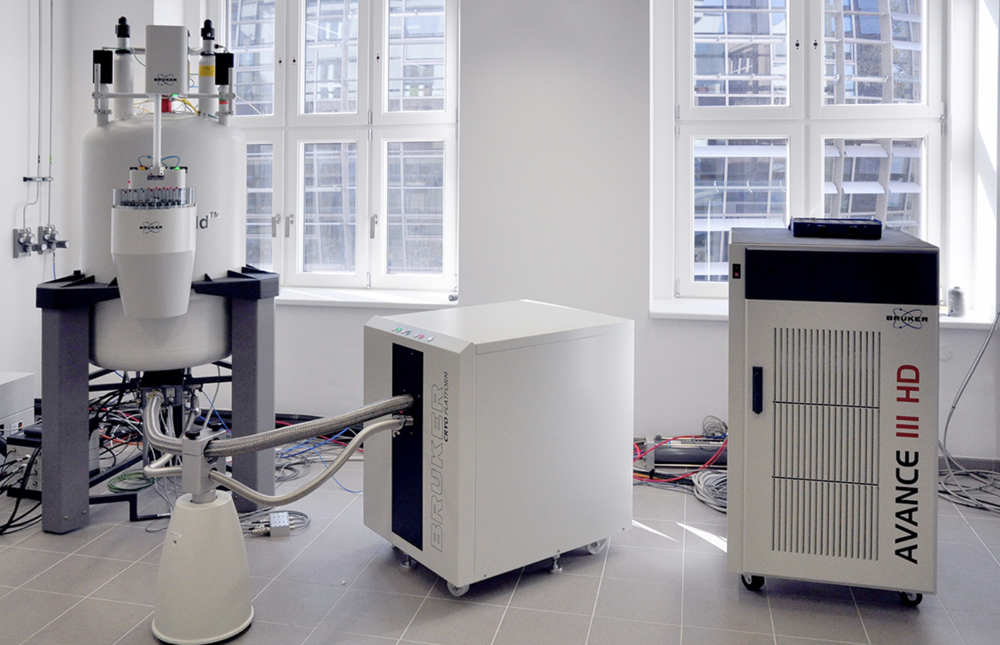

# Nightingale metabolomics dataset

### Description 

The dataset, derived from Nightingale Health's metabolic profiling of blood serum samples, presents an extensive array of metabolites, encapsulating lipids, fatty acids, amino acids, and various low-molecular-weight metabolites. Utilizing innovative Nuclear Magnetic Resonance (NMR) technology, the dataset unveils a spectrum of 250 biomarkers, 39 of which are clinically validated, offering a profound insight into the metabolic mechanisms underlying health and disease.

### Introduction

Nightingale Health is a global health-tech company that is changing healthcare with its advanced blood testing technology, employing its proprietary Nuclear Magnetic Resonance (NMR). The biomarker panel provided by Nightingale encompasses a total of 250 biomarkers, of which 39 have been clinically validated. These biomarkers span across various categories including lipoprotein lipids, fatty acids, and small molecules such as amino acids and ketones, thereby offering a rich tapestry of metabolic insights.
The dataset generated from the metabolic profiling of our blood serum samples allows for an in-depth exploration into the metabolic foundations of both health and disease.
The data captures a wide spectrum of metabolites including lipids, fatty acids, amino acids, and other low-molecular-weight metabolites, all rendered through Nightingale's advanced NMR technology. 

This dataset serves as a valuable resource for:
1. Identifying Metabolic Signatures: Unveiling unique metabolic patterns linked with various health conditions.
2. Predictive Modeling: Building predictive models for early disease detection and prognosis.
3. Nutritional Analysis: Evaluating the influence of nutrition on metabolic profiles.
4. Drug Response Analysis: Understanding the metabolic responses to drug treatments.

Furthermore, the dataset holds promise for multi-omic analyses when combined with genomic, transcriptomic, etc. thus presenting a holistic view of the biological and metabolic landscape. The comprehensive nature of this dataset, coupled with the innovative technology from Nightingale, provides a valuable resource for propelling research and clinical applications aimed at ameliorating health outcomes.

The Nightingale NMR platform stands out from other metabolomics techniques such as mass spectrometry, due to its minimal batch effects, low requisites for expensive reagents, and high throughput at a relatively lower cost. NMR spectroscopy, grounded in the interaction of externally applied radiofrequency radiation with atomic nuclei, facilitates the quantification of over 200 biomarkers in absolute units from a single blood sample. The absolute concentrations of metabolite levels provided are calibrated against global standards, making the results easily comparable to other studies and traditional clinical chemistry methods.

### Measurment protocol <!-- long measurment protocol for the data browser -->

After collecting blood samples from participants during clinic visits, the blood samples are immediately placed in tubes and processed to separate the serum. These serum samples are then stored in plates and kept in the freezer to maintain their integrity until shipment.
Upon arrival at Nightingale Health's laboratories, the serum samples are once again frozen. When ready for analysis, the samples are thawed and undergo a series of preparatory steps.
Firstly, the samples are subjected to centrifugation, which helps to remove any remaining cellular debris and ensures a clear serum sample. 
Following preparation, the samples are analyzed using nuclear magnetic resonance (NMR) spectroscopy. NMR spectroscopy measures the magnetic properties of atomic nuclei to determine the concentrations of various metabolites present in the serum. This technology allows for the simultaneous quantification of multiple metabolites from a single blood sample, including lipids, fatty acids, amino acids, and various low-molecular-weight compounds.

The spectrometer machine used for these analyses is the Bruker AVANCE III 500 #60, which is well-regarded for its precision and reliability in metabolic profiling.

Nightingale Health utilizes advanced algorithms to process the spectral data obtained from NMR, identifying and quantifying a wide range of metabolites. 
To ensure data quality and accuracy, Nightingale Health provides a comprehensive quality control (QC) report for each batch of samples. This report includes categorical QC tags for each metabolite in each sample and binary QC indications per sample, highlighting any potential issues that may need addressing.

For more detailed information on Nightingale Health’s technology and measurement protocol, you can visit their website https://nightingalehealth.com/technology and explore their [Biomarkers](https://research.nightingalehealth.com/biomarkers).

### Data availability <!-- for the example notebooks -->

The information is stored in 2 parquet file:
1. Results - nightingale_metabolomics.parquet - quantification of metabolites in blood sample.
2. Tags per Biomarker - tags_per_biomarker.parquet - categorical tags per metabolite per sample

As of 2024-02-01, the dataset contains 1700 participants who were analyzed.

### Summary of available data <!-- for the data browser -->

We sent our samples to Nightingale in two batches (with more planned):
Batch #1 (POC, 6/6/2023) - Total entries: 1,827 / Unique participant IDs: 1,714
Batch #2 (15/04/2024) - Total entries: 8,387 / Unique participant IDs: 7,454

### Relevent links

* Pheno Knowledgebase: https://knowledgebase.pheno.ai/datasets/029-nightingale_metabolomics.html