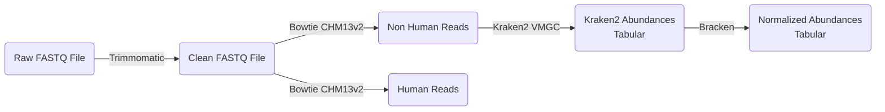

# Vaginal microbiome dataset  

### Description 

The vaginal microbiome dataset characterizes the bacterial communities present in the vaginal environment via metagenomic sequencing of vaginal swab samples. This dataset enables the exploration of the diverse bacterial populations residing in the vaginal tract, their relative abundances, and potential associations with women's health conditions. Understanding the vaginal microbiome composition provides insights into conditions such as bacterial vaginosis and other vaginal health-related outcomes.

### Introduction

The vaginal microbiome represents a dynamic ecosystem that plays a crucial role in maintaining vaginal health. Unlike the gut microbiome, a healthy vaginal microbiome is often characterized by lower diversity and dominance of specific bacterial genera, particularly *Lactobacillus* species. Alterations in the vaginal bacterial community have been associated with various health conditions, including bacterial vaginosis, which affects 20-60% of women globally.

Through shotgun metagenomic sequencing of vaginal swab samples, this dataset provides comprehensive taxonomic profiling of vaginal bacterial communities. The data enables investigation of the relationship between vaginal microbiome composition and various health outcomes, reproductive health, and other phenotypic characteristics collected as part of the Human Phenotype Project.

Note: The current DNA extraction protocol is optimized for bacterial DNA and does not adequately recover fungal DNA. Therefore, fungal species (such as *Candida*) are not reliably detected in this dataset.

### Measurement protocol 
<!-- long measurment protocol for the data browser -->
To characterize the vaginal microbiome, the following steps are performed:

1. **Sample collection**: A vaginal swab sample is collected from each participant during their visit using a standardized swab kit.
2. **DNA extraction**: DNA is extracted from the swab sample using techniques optimized for bacterial DNA isolation.
3. **DNA sequencing**: The extracted DNA is sequenced using high-throughput sequencing technologies.
4. **Quality control and filtering**: Raw sequencing reads are processed using Trimmomatic with a minimum length setting of 50 to remove low-quality reads and sequencing artifacts.
5. **Human read removal**: Human reads are filtered using Bowtie with the CHM13v2 (T2T) human genome reference to isolate non-human (microbial) sequences.
6. **Taxonomic classification**: Non-human reads are classified using Kraken2 against the Vaginal Microbiome Genome Collection (VMGC) reference database to identify bacterial species and their abundances.
7. **Abundance normalization**: Bacterial abundances are normalized at the genus and species levels using Bracken.

A minimum threshold of 50,000 non-human reads is required for reliable species detection and sample differentiation.

### Data availability 
<!-- for the example notebooks -->
The information is stored in multiple parquet files:

- `vaginal_microbiome.parquet`: Sequencing and QC statistics.
- `kraken_*`: Tables with Kraken2/VMGC relative abundances, separated by taxonomic levels.

### Summary of available data 
<!-- for the data browser -->
- DNA Sequencing files
    - Raw FASTQ file
    - Trimmed FASTQ file
    - Non-human FASTQ file (filtered)
- Bacterial
    - Kraken2/VMGC output
    - Bracken normalized abundances

### Relevant links

* [Pheno Knowledgebase](https://knowledgebase.pheno.ai/datasets/030-vaginal_microbiome.html)
* [Pheno Data Browser](https://pheno-demo-app.vercel.app/folder/30)