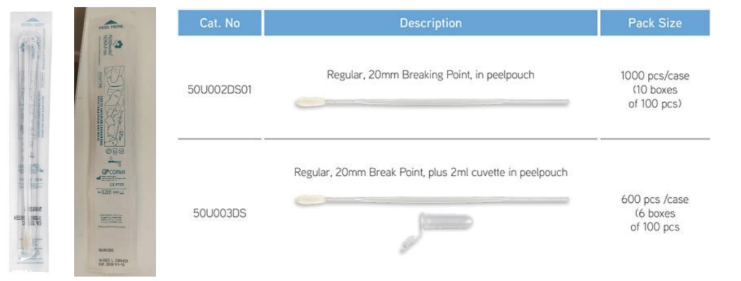

# Vaginal microbiome dataset  

### Description 

The vaginal microbiome dataset characterizes the bacterial communities present in the vaginal environment via metagenomic sequencing of vaginal swab samples. This dataset enables the exploration of the diverse bacterial populations residing in the vaginal tract, their relative abundances, and potential associations with women's health conditions. Understanding the vaginal microbiome composition provides insights into conditions such as bacterial vaginosis and other vaginal health-related outcomes.

### Introduction

The vaginal microbiome represents a dynamic ecosystem that plays a crucial role in maintaining vaginal health. Unlike the gut microbiome, a healthy vaginal microbiome is often characterized by lower diversity and dominance of specific bacterial genera, particularly *Lactobacillus* species. Alterations in the vaginal bacterial community have been associated with various health conditions, including bacterial vaginosis, which affects 20-60% of women globally.

Through shotgun metagenomic sequencing of vaginal swab samples, this dataset provides comprehensive taxonomic profiling of vaginal bacterial communities. The data enables investigation of the relationship between vaginal microbiome composition and various health outcomes, reproductive health, and other phenotypic characteristics collected as part of the Human Phenotype Project.

Note: The current DNA extraction protocol is optimized for bacterial DNA and does not adequately recover fungal DNA. Therefore, fungal species (such as *Candida*) are not reliably detected in this dataset.

### Measurement protocol 
<!-- long measurment protocol for the data browser -->
To characterize the vaginal microbiome, the following steps are performed:

1. **Sample collection**: A vaginal swab sample is self-collected by each participant during their visit using a standardized swab kit.
2. **DNA extraction**: DNA is extracted from the swab sample using techniques optimized for bacterial DNA isolation.
3. **DNA sequencing**: The extracted DNA is sequenced using high-throughput sequencing technologies.
4. **Quality control and filtering**: Raw sequencing reads are processed using Trimmomatic with a minimum length setting of 50 to remove low-quality reads and sequencing artifacts.
5. **Human read removal**: Human reads are filtered using Bowtie with the CHM13v2 (T2T) human genome reference to isolate non-human (microbial) sequences.
6. **Taxonomic classification**: Non-human reads are classified using Kraken2 against the Vaginal Microbiome Genome Collection (VMGC) reference database to identify bacterial species and their abundances.

A minimum threshold of 50,000 non-human reads is required for reliable species detection and sample differentiation.



**Figure 1: Vaginal Microbiome Kit Components.**
The kit includes a sterile swab in a medical grade paper pouch. An empty tube for placing the sampled tip after sampling is also present in cat:50U003DS. However, this tube is not used, as the CTC coordinator provides the participant with a separate safelock barcoded tube prior to VMB sampling. To conduct the self-sample test, the participant is instructed to wash her hands with soap (or put on gloves). She should then place the provided barcoded tube on the designated stand and open the paper pouch. Then, by holding the swab in the middle of the handle, perform the self-sampling test.

### Data availability 
<!-- for the example notebooks -->

A vaginal swab sample is collected from every female HPP participant. To date, 1,622 samples have been sequenced and processed through the vaginal microbiome pipeline. Per-participant output files include:

- **Kraken2 report**: A tab-delimited file summarizing taxonomic classification results. Each row represents a taxon and includes the percentage of reads assigned, number of reads assigned directly and to the clade, taxonomic rank (Domain, Phylum, Class, Order, Family, Genus, Species), taxonomic ID, and taxon name.

- **Kraken2 output**: A per-read classification file where each row represents a single sequencing read. Columns indicate classification status (C = classified, U = unclassified), read ID, assigned taxonomic ID, read length, and k-mer mapping information showing how the read was classified across its length.
```{mermaid}
graph LR;
    A(Raw FASTQ File) --> |Trimmomatic| B(Clean FASTQ File)
    B --> |Bowtie CHM13v2| C(Non Human Reads)
    B --> |Bowtie CHM13v2| D(Human Reads)
    C --> |Kraken2 VMGC| E(Kraken2 Report)
    C --> |Kraken2 VMGC| F(Kraken2 Output)
```

### Summary of available data 
<!-- for the data browser -->

- DNA Sequencing files
    - Raw FASTQ file
    - Trimmed FASTQ file
    - Non-human FASTQ file (filtered)
- Bacterial
    - Kraken2 report (taxonomic abundance summary)
    - Kraken2 output (per-read classifications)