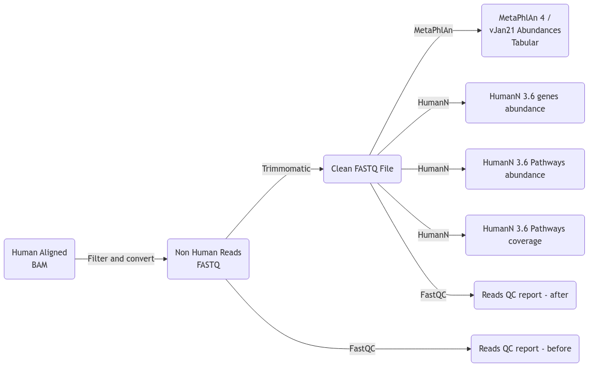

# Oral microbiome dataset  

### Description 

The collection of buccal swabs for human genetic sequencing presents an advantageous opportunity to simultaneously explore the oral microbiome using the non-human DNA sequences found. This metagenomic analysis provides insight into the diverse microbial community within the buccal mucosa. The obtained data not only enriches our genetic understanding but also broadens our knowledge on the microorganisms residing in the oral cavity, their interactions, and potential implications for oral and systemic health. This dual analysis underscores the utility of buccal swabs as a resourceful means for both genetic and microbial investigations.

### Introduction

The primary intent behind collecting buccal swabs was to explore human genetics. Concurrently, it yielded metagenomic data, unveiling the microbial community within the oral cavity.

This data illuminates the diversity and interactions of microorganisms, specifically in the buccal mucosa. Delving into the oral microbiome presents an opportunity to understand its linkage to health conditions. For instance, an imbalanced oral microbiome can lead to periodontal disease, associated with an increased risk of cardiovascular diseases. Moreover, alterations in the oral microbiome have been observed in oral cancers, hinting at its potential role in their onset and progression​ [The oral microbiome: diversity, biogeography and human health](https://www.nature.com/articles/s41579-023-00963-6)​. 

Through this data, the exploration into possible connections between oral microbial composition and various health conditions is facilitated, marking a step towards understanding the broader health implications.

### Measurement protocol 
<!-- long measurment protocol for the data browser -->
This dataset is a derivative of the human genome dataset (that has been collected via buccal swabs) - ergo the measurement protocol can be found at the Human genetics dataset.

### Data availability 
<!-- for the example notebooks -->
The information is stored in multiple parquet files:
- `oral_microbiome.parquet`: Sequencing and QC statistics.
- `metaphlan_*`: 8 tables with MetaPhlAn 4 vJan21 relative abundances, separated by taxonomic levels.
- `humann_aggregated_*`: arrow files of either gene level abundances or pathway level abundances+coverage from HumanN 3.6 given MetaPhlAn 4 vJan21 outputs

```mermaid
graph LR;
    A(Human Aligned<br>BAM) --> |Filter and convert| B(Non Human Reads<br>FASTQ)
    B --> |Trimmomatic| C(Clean FASTQ File)
    C --> |MetaPhlAn| D(MetaPhlAn 4 /<br>vJan21 Abundances<br>Tabular)
    C --> |HumanN| E(HumanN 3.6 genes abundance)
    C --> |HumanN| F(HumanN 3.6 Pathways abundance)
    C --> |HumanN| G(HumanN 3.6 Pathways coverage)
    C --> |FastQC| H(Reads QC report - after)
    B ---> |FastQC| I(Reads QC report - before)
```

### Summary of available data 
<!-- for the data browser -->
- DNA Sequencing files
    - Non human FASTQ file
    - Trimmed Non human FASTQ file
- QC
    - FASTQC files
- Bacterial
    - HumanN (3.6) output
    - MetaPhlAn4 (vJan21) output

### Relevant links

* Pheno Knowledgebase: https://knowledgebase.pheno.ai/datasets/070-oral_microbiome.html