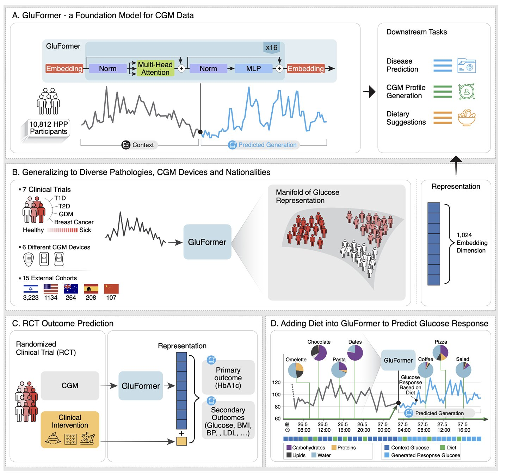

Lutsker G, Sapir G, Godneva A, Shilo S, Greenfield J, Samocha-Bonet D, Mannor S, Meirom E, Chechik G, Rossman H, Segal E, [*arxiv*](https://arxiv.org/abs/2408.11876)

[//]: # (table_of_contents is not supported)

## Paper summary

The [paper](http://arxiv.org/abs/2408.11876) describes the GluFormer model that was developed based on CGM data from 10,812 non-diabetic individuals from the HPP dataset. The AI model is from the class of transformer-based generative models, similar to ChatGPT (GPT = Generative, Pretrained, Transformer). For each glucose measurement, it provides a prediction for the next point in time. The model offers insights into metabolic health, predicting health outcomes 4 years in advance, outperforming state-of-the-art CGM analysis tools. It can be used for different downstream tasks, for example to forecast outcomes of clinical trials or to simulate glucose response to diet. 

 